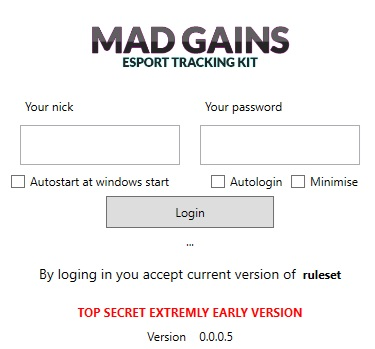
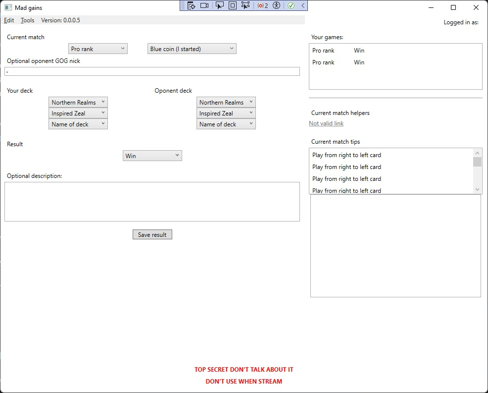
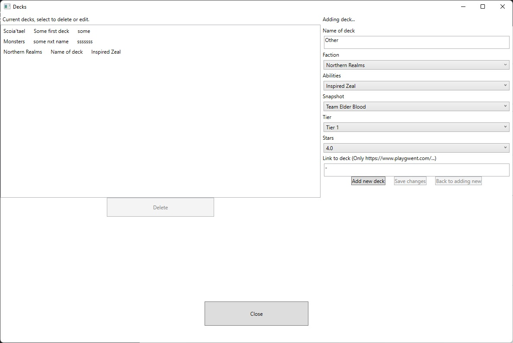
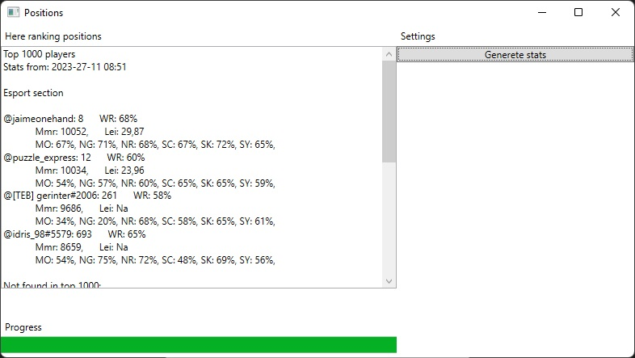

# MadGainsEsportManager

## Description

Mad Gains Esport Manager (C#, .NET, WPF, threads, libraries for scraping) allows tracking match results for players and decks.
It scraps the website to get the current results of team players (currently set up for the game Gwent).

## Features

- Backuping and tracking results of players in esport game
- Scraping websites for data abou performence of players
- Counting various stats (win ratio etc.) for players
- Login and autostart funcionality
- NotifyIcon

## Screenshots

 Login Window 

 Main window of the app

 Window with adding and editing decks

 Window with stats of players

## Roadmap

- All planed funcionality has been implemented.

## Deployment and running

Clone the project.

Have .NET 8 installed.

Run from Visual Studio 2022 or above.

## Usefull links

 - [Elder Blood](https://www.teamelderblood.com/)
